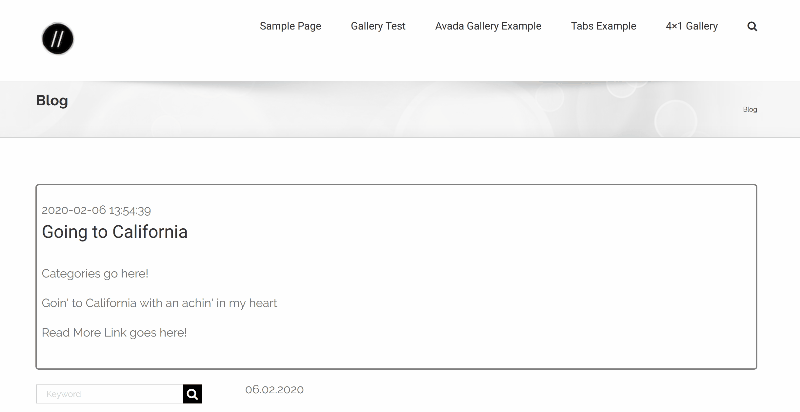
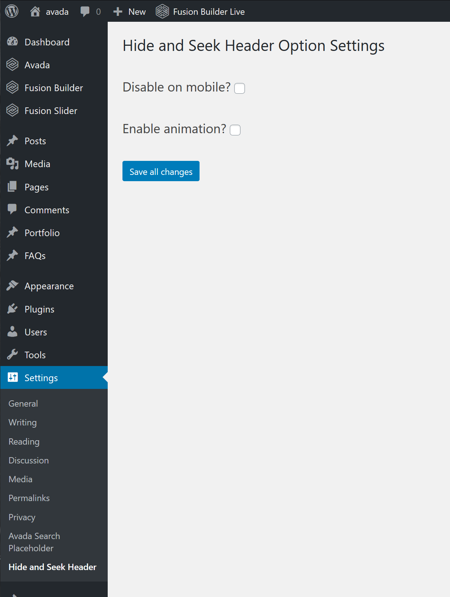

# Hide and Seek Header Plugin

## For Avada by ThemeFusion

This WordPress plugin hides the site header on down scroll events for the Avada theme. Eventually it will hide the header on scroll up or down or both (?), and it will support other themes.

## Motivation

See the [original Avada forum thread](https://theme-fusion.com/forums/topic/avada-sticky-header-on-scroll-up-only/) where this plugin was conceived.

## Features

- Hides the sticky header on scroll down **only** as originally requested.
- Option to disable on mobile (devices smaller than 800px wide&mdash;the Avada default).
- Option to enable fade animation on hiding.
- Super simple install. Two steps and your done.
- Lightweight&mdash;under 100 KB zipped.

#### Preview

## Codepen

Kick the tires on [CodePen](https://codepen.io/marklchaves/pen/RwNOVzQ).

---

## Installation

1. Manually upload the zip of this repo to /wp-content/plugins/hide-and-seek-header directory or upload the zip via your wp-admin **Plugins** > **Add New** > **Upload Plugin**. Note: you may want to remove the `.git*` files and directories, the 0.1.1 zip file, and screen-grabs directory before uploading. These are not needed for the plugin to run.
2. Activate the plugin through the wp-admin **Plugins** page.

That's it!

This is the recommended and standard WordPress install process. There are many advantages of following this approach such as 2-click install, no coding, no need for FTP, and version update notifications. 

### DEPRECATED IN VERSION 1.0 

<blockquote>
If you absolutely need to bypass this process, the instructions for _hand-dropping_ the plugin are in the [wiki](https://github.com/marklchaves/hide-and-seek-header/wiki/#hand-drop-instructions). These instructions apply only to version 0.1.1. I've kept the 0.1.1 [zip file](https://github.com/marklchaves/hide-and-seek-header/raw/master/hide-and-seek-header.zip) around if needed.
</blockquote>

---

## Settings

The plugin settings are under **Settings > Hide and Seek Header**.

### Disable on Mobile

By default, the plugin will hide headers for all devices. Check **Disable on mobile?** to keep the header visible on small devices. The current default breakpoint is `800px`. 

Uncheck to hide the header on all devices.

Click **Save all changes** to save your options.

### Enable Animation

The animation is disabled by default. Check **Enable animation?** to turn on a `0.5 second` fade-out effect when the header begins to disappear.

---

## Version: 1.0.0

#### Developed On

- WordPress: 5.3.2
- PHP: 7.3.5
- Avada: 6.2.1; tested up to 6.2.2

---

## Compliance

This plugin follows the [WordPress Plugin Handbook](https://developer.wordpress.org/plugins/). Namely that it cannot be called directly via a public URL, has a unique namespace, and [properly enqueues](https://developer.wordpress.org/plugins/javascript/enqueuing/) its CSS and JavaScript assets.

---

## Roadmap

I'll keep an updated wishlist on [the Wiki](https://github.com/marklchaves/hide-and-seek-header/wiki) for this repo.

---

## I'll Drink to That ;-)

