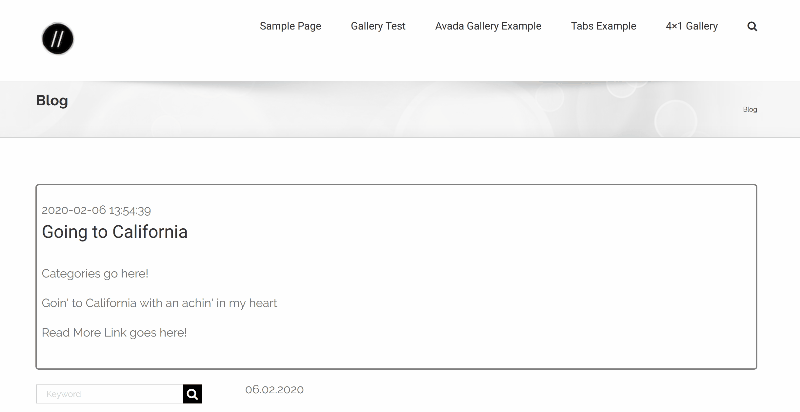
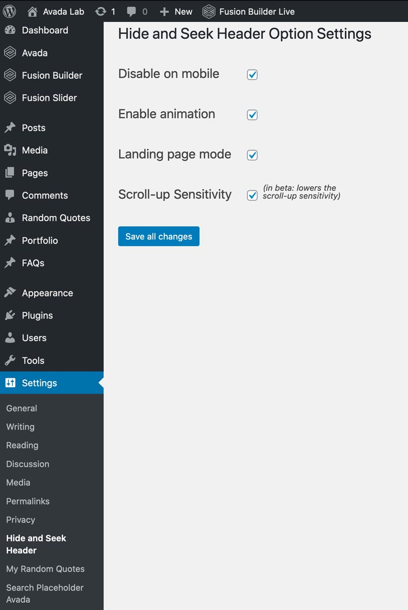
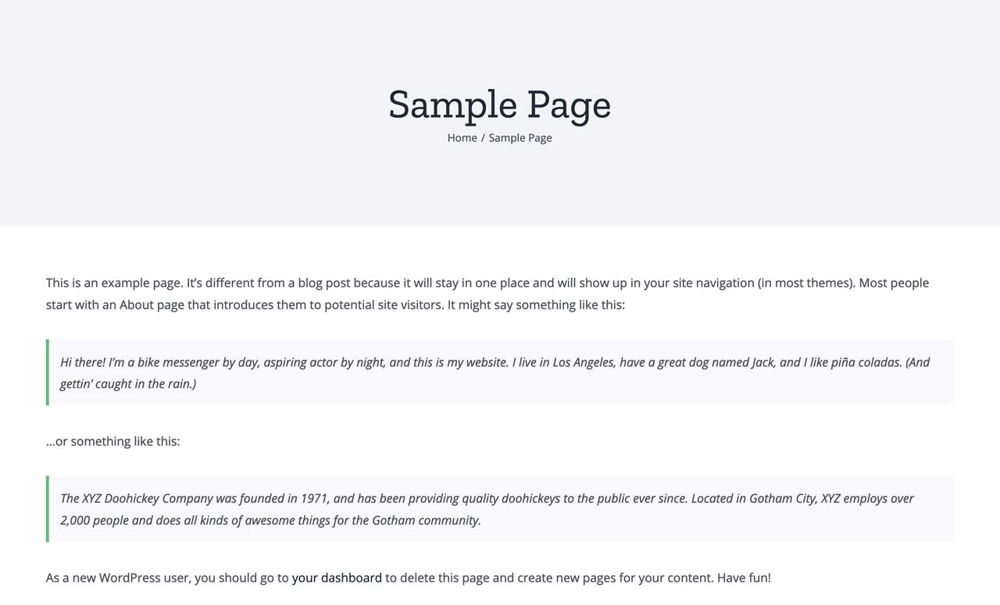
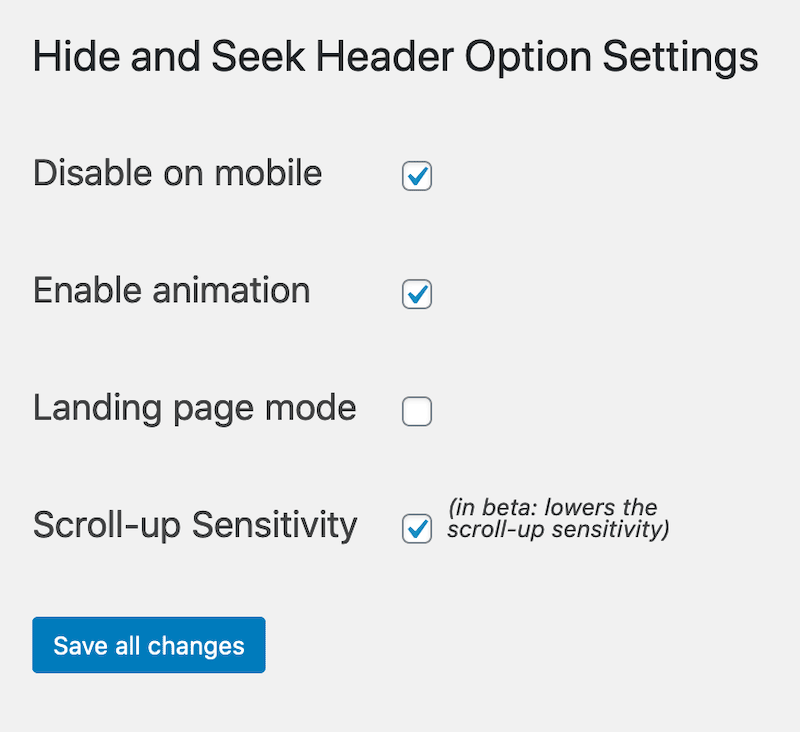

# Hide and Seek Header Plugin

## For Avada by ThemeFusion

This [WordPress plugin](https://wordpress.org/plugins/hide-and-seek-header/) hides the site header on down scroll events for the Avada theme. Eventually it will hide the header on scroll up or down or both (?), and it will support other themes.

## Motivation

See the [original Avada forum thread](https://theme-fusion.com/forums/topic/avada-sticky-header-on-scroll-up-only/) where this plugin was conceived.

## Features

* Hides the sticky header on scroll down **only**.
* Option to disable on mobile (devices smaller than 800px wide&mdash;the Avada default).
* Option to enable fade animation on hiding.
* Option to enable landing page mode. The plugin hides the standard header (non-sticky) so only the sticky header displays on scrolling up.
* Super simple install. Two steps and your done.
* Lightweight&mdash;about 30 KB zipped.

#### Preview

## Codepen

Kick the tires on [CodePen](https://codepen.io/marklchaves/pen/RwNOVzQ).

---

## Installation

1. Manually upload the zip of this repo to /wp-content/plugins/hide-and-seek-header directory or upload the zip via your wp-admin **Plugins** > **Add New** > **Upload Plugin**. Note: you may want to remove the `.git*` files and directories, the 0.1.1 zip file, and screengrabs directory before uploading. These are not needed for the plugin to run.
2. Activate the plugin through the wp-admin **Plugins** page.

That's it!

This is the recommended and standard WordPress install process. There are many advantages of following this approach such as 2-click install, no coding, no need for FTP, and version update notifications. 

### DEPRECATED IN VERSION 1.0 

<blockquote>
If you absolutely need to bypass this process, the instructions for _hand-dropping_ the plugin are in the [wiki](https://github.com/marklchaves/hide-and-seek-header/wiki/#hand-drop-instructions). These instructions apply only to version 0.1.1. I've kept the 0.1.1 [zip file](https://github.com/marklchaves/hide-and-seek-header/raw/master/hide-and-seek-header.zip) around if needed.
</blockquote>

---

## Settings

The plugin settings are under **Settings > Hide and Seek Header**.

### Disable on Mobile

By default, the plugin will hide headers for all devices. Check **Disable on mobile** to keep the header visible on small devices. The current default breakpoint is `800px`. 

Uncheck to hide the header on all devices.

### Enable Animation

The animation is disabled by default. Check **Enable animation** to turn on a `0.5 second` fade-out effect when the header begins to disappear.

### Enable Landing Page Mode

Check **Landing page mode**, if you want to hide the standard top header and menu on page load. This is great for minimising distractions.

### Scroll-up Sensitivity (beta)

Check to lower scrolling up sensitivity. This helps reduce flickering of the header on touch screens.

Click **Save all changes** to save your options.

---

## Screengrabs

### Settings Page

### Landing Page Mode

### Sensitivity Setting

---

## Version 1.3.0

* Fixed: If the mobile menu is open, a large space is left on scroll down.
* Removed extra space left by the hidden header on landing page mode. See the associated [GitHub issue](https://github.com/marklchaves/hide-and-seek-header/issues/12) for more details.
* Removed extra space when using a slider in parallax mode. However, you'll need to increase the height of the slider by height of the header to offset the negative margin from Avada. E.g., If the height slider image is 849px and the height of the header is 84, then the slider's final height should be set to 933px. This is described in the parallax setting and in the Avada docs.
* Could **not** reliably repro active pointer events when the header is hidden (even with mega menu). But, disabled pointer events in CSS when the header is hidden to be extra sure. See the related [GitHub issue](https://github.com/marklchaves/hide-and-seek-header/issues/11) for more details.
* Tested on Avada 6.2.2 and 6.2.3.

## Version 1.2.0

* Added scroll-up sensitivity to reduce flickering (appear/reappear) of sticky header on touch screens. (beta)
* Refactored admin page so that setting fields line up better.
* Added DB clean up of options on uninstall.

## Version 1.0.1

Tested on WordPress 5.4. No issues. No code changes required.

## Version 1.0.1

Reverted CSS to original v 0.0.1 code. Version 1.0 CSS for no animation broke formatting for headers 2-5.

## Version: 1.0.0

#### Developed On

- WordPress: 5.3.2
- PHP: 7.3.5; tested on 7.2.18
- Avada: 6.2.1; tested up to 6.2.2

---

## Compliance

This plugin follows the [WordPress Plugin Handbook](https://developer.wordpress.org/plugins/). Namely that it cannot be called directly via a public URL, has a unique namespace, and [properly enqueues](https://developer.wordpress.org/plugins/javascript/enqueuing/) its CSS and JavaScript assets.

---

## Status Updates &amp; Roadmap

I'll give status updates and keep an wishlist on [the Wiki](https://github.com/marklchaves/hide-and-seek-header/wiki) for this repo.

---

## Disclaimer

The Hide and Seek Header plugin and its author are not affiliated with Avada or ThemeFusion in any way.

---

## I'll Drink to That ;-)

